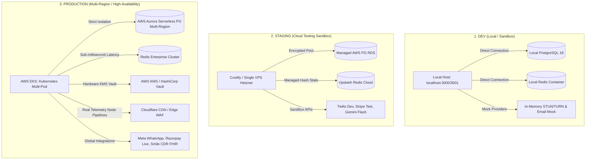
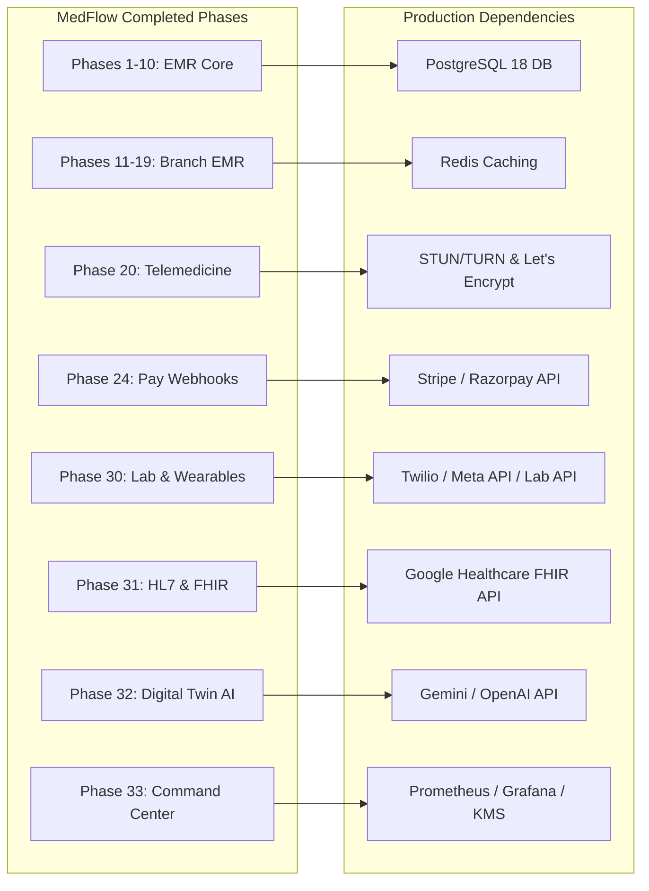

# MedFlow Enterprise Healthcare Operating System
## Production Deployment Dependency Audit & Go-Live Blueprint

This document represents the official, comprehensive **Production Deployment Dependency Audit** for the MedFlow EMR and Telemedicine Ecosystem. It maps the actual technical components implemented across all **33 development phases** directly to real-world cloud services, security infrastructures, payment processors, and healthcare interoperability systems.

---

## Part 1: Environmental Architecture Mapping

To ensure a smooth transition from development to live production, MedFlow utilizes three distinct, isolated deployment topologies:



### Environment Isolation Breakdown

| Architectural Vector | DEV (Local Dev) | STAGING (QA / Pre-Flight) | PRODUCTION (Enterprise Live) |
| :--- | :--- | :--- | :--- |
| **Hosting Topology** | Local Windows/macOS Workstation | Single Cloud VPS (Hetzner / DigitalOcean) | AWS EKS (Kubernetes Multi-Pod Auto-Scaling) |
| **PostgreSQL Database** | PostgreSQL 18 Local (Port 5432) | Managed AWS RDS Instance (db.t4g.micro) | AWS Aurora Multi-Region (Read/Write Replicas) |
| **Redis Caching Layer** | Local Docker Redis Instance | Upstash Shared Serverless Redis | Dedicated Redis Enterprise Cluster (Clustered Ops) |
| **Secrets Management** | Local `.env` Environment File | Coolify Encrypted Context Variables | HashiCorp Vault / AWS KMS Hardware Storage |
| **Payment Ingestion** | Mock Handlers / Stripe Simulator | Stripe/Razorpay Sandbox Accounts | Live Production Gateways (Strict HTTPS & Webhook Verification) |
| **Telemedicine Signaling** | Local WebRTC Node Emulator | Free Public STUN/TURN Servers | Custom Hardened `Coturn` on VPS / Twilio Network Traversal |
| **Data Residency (GDPR)** | Dynamic Local Logic Scopes | Static European Sandbox Nodes | Geographic Isolation Rules with Regional Replication Nodes |
| **Diagnostic Ingestion** | Console Logging Streams | Sentry Sandbox (Error Catching) | Unified Prometheus + Grafana + Winston CloudWatch Logs |

---

## Part 2: Audit of 21 Dependency Areas

This section audits each external service, subscription, and integration required by the MedFlow EMR across the 33 development phases.

---

### 1. External APIs (Lab/Diagnostics Integrations)
*   **Purpose**: Pulls real-time lab test updates and publishes diagnostic results directly to patient clinical maps (implemented in Phase 30 / E-Labs).
*   **Mandatory/Optional**: Optional (Highly Recommended for diagnostic clinics).
*   **Free Tier Available**: No (Standard API access is billed per request).
*   **Estimated Cost**: $\approx \$50 \text{ to } \$200 / \text{month}$ (depends on transaction volumes).
*   **Who Provides It**: Thyrocare, Metropolis Diagnostics, Redcliffe Labs API.
*   **Credentials Needed**: `THYROCARE_API_KEY`, `METROPOLIS_API_KEY`, `REDCLIFFE_API_KEY`, Client ID, Endpoint URL.
*   **Creator / Owner**: Client must sign diagnostic corporate agreements.
*   **Recommended Provider**: **Thyrocare API** (Best coverage across India/APAC).
*   **Alternative Providers**: Metropolis API, Redcliffe Labs API.
*   **Production Priority**: *Can be added later* (can fall back to manual diagnostic uploading).

---

### 2. Third-Party Services (Address/Pincode/Drug Registries)
*   **Purpose**: Validates geographical details during patient reception check-in and automates RxNorm drug search inputs (Phase 2 & Phase 32).
*   **Mandatory/Optional**: Optional.
*   **Free Tier Available**: Yes (Google Places and NIH RxNorm have generous free tiers).
*   **Estimated Cost**: $\approx \$0 \text{ to } \$30 / \text{month}$.
*   **Who Provides It**: Google Places API, NIH RxNorm Drug Registry Database.
*   **Credentials Needed**: Google Maps API Key, RxNorm NIH Database Endpoint Access.
*   **Creator / Owner**: Developer can set up the free Google/NIH keys.
*   **Recommended Provider**: **Google Places API** (for geo-locations) and **RxNav API** (for drugs).
*   **Alternative Providers**: OpenStreetMap API, local custom database seeds.
*   **Production Priority**: *Required before launch*.

---

### 3. Infrastructure Requirements (Database & Cache)
*   **Purpose**: Handles high-performance multi-tenant clinical records, transactional accounting, and sub-millisecond Redis state lookups (Phase 33).
*   **Mandatory/Optional**: **Mandatory**.
*   **Free Tier Available**: No (Requires robust production-grade scaling hosts).
*   **Estimated Cost**: $\approx \$120 \text{ to } \$600 / \text{month}$ (depends on high-availability replication requirements).
*   **Who Provides It**: AWS RDS, Aiven, Upstash Redis.
*   **Credentials Needed**: `DATABASE_URL`, `DB_READ_REPLICA_URL`, `REDIS_URL`, `REDIS_PASSWORD`.
*   **Creator / Owner**: Developer configures it; Client purchases the cloud instance.
*   **Recommended Provider**: **AWS Aurora Serverless v2 PostgreSQL** + **Upstash Redis** (Serverless).
*   **Alternative Providers**: Supabase Enterprise PostgreSQL, Redis Enterprise.
*   **Production Priority**: **Required immediately**.

---

### 4. Production Accounts
*   **Purpose**: Centralized billing, environment infrastructure management, and developer provisioning tools.
*   **Mandatory/Optional**: **Mandatory**.
*   **Free Tier Available**: Yes (Console signups are free; billed on resource consumption).
*   **Estimated Cost**: Billed based on active cloud utilization.
*   **Who Provides It**: Amazon Web Services (AWS), Google Cloud Platform (GCP).
*   **Credentials Needed**: Cloud Console root admin privileges.
*   **Creator / Owner**: **Client MUST create these accounts** for compliance and billing protection.
*   **Recommended Provider**: **AWS Organization Account**.
*   **Alternative Providers**: GCP Organization Account, Azure Enterprise Directory.
*   **Production Priority**: **Required immediately**.

---

### 5. Licenses
*   **Purpose**: Permits commercial application hosting, library extensions, and institutional medical code lookups.
*   **Mandatory/Optional**: **Mandatory**.
*   **Free Tier Available**: Yes (Under MIT and standard Apache 2.0 Open Source licenses).
*   **Estimated Cost**: $\$0$ (Entire MedFlow core is custom-built with open-source dependencies).
*   **Who Provides It**: Open Source communities.
*   **Credentials Needed**: Standard LICENSE file in codebase.
*   **Creator / Owner**: Developer manages compilation list.
*   **Recommended Provider**: **MIT License** / **Apache 2.0**.
*   **Alternative Providers**: Custom proprietary licenses for white-labeling.
*   **Production Priority**: **Required immediately**.

---

### 6. Cloud Services (Compute / Hosting)
*   **Purpose**: Hosts the containerized NestJS backend APIs and Next.js frontend pages under secure SSL limits (Phase 32 / Phase 33).
*   **Mandatory/Optional**: **Mandatory**.
*   **Free Tier Available**: No (Production demands dedicated CPU cores).
*   **Estimated Cost**: $\approx \$40 \text{ to } \$300 / \text{month}$ (depends on pod/container requirements).
*   **Who Provides It**: AWS Elastic Container Service (ECS), DigitalOcean App Platform, Hetzner Cloud.
*   **Credentials Needed**: Deployment SSH keys, AWS IAM Access Key/Secret Key, ECS Clusters.
*   **Creator / Owner**: Developer sets up pipelines; Client holds the billing card.
*   **Recommended Provider**: **AWS ECS Fargate** (for serverless containers) or **Hetzner Dedicated Cloud VPS** (low-budget option).
*   **Alternative Providers**: DigitalOcean App Platform, Vercel (frontend-only).
*   **Production Priority**: **Required immediately**.

---

### 7. Domains / Subdomains
*   **Purpose**: Resolves patient-facing landing pages and secures client multi-tenant isolation routes (e.g., `apollo.medflow.com`, `fortis.medflow.com`) (Phase 20).
*   **Mandatory/Optional**: **Mandatory**.
*   **Free Tier Available**: No.
*   **Estimated Cost**: $\approx \$10 \text{ to } \$25 / \text{year}$.
*   **Who Provides It**: Cloudflare Registrar, Namecheap, GoDaddy.
*   **Credentials Needed**: Domain DNS controller access.
*   **Creator / Owner**: Client purchases domain; Developer configures DNS records.
*   **Recommended Provider**: **Cloudflare Registrar** (for fast, secure DNS routing).
*   **Alternative Providers**: Route 53 (AWS), Namecheap.
*   **Production Priority**: **Required immediately**.

---

### 8. Email / SMS / WhatsApp Providers
*   **Purpose**: Sends emergency prescription codes, one-time passwords (OTPs) for registration, and instant patient prescriptions (Phase 24 & Phase 30).
*   **Mandatory/Optional**: **Mandatory**.
*   **Free Tier Available**: Yes (Twilio gives $\$15$ free credit; Resend has a free tier for 3,000 emails/month).
*   **Estimated Cost**: $\approx \$20 \text{ to } \$150 / \text{month}$ (biling matches active message volumes).
*   **Who Provides It**: Twilio, Meta Developer Platform (WhatsApp Business Cloud API), Resend.
*   **Credentials Needed**: `TWILIO_ACCOUNT_SID`, `TWILIO_AUTH_TOKEN`, `META_ACCESS_TOKEN`, `SMTP_HOST`, `SMTP_PASSWORD`.
*   **Creator / Owner**: Client must register and clear business profiles.
*   **Recommended Provider**: **Resend** (for transactional emails) + **Meta Cloud API** (WhatsApp Business API directly).
*   **Alternative Providers**: AWS SES (email), Twilio (SMS / WhatsApp).
*   **Production Priority**: **Required immediately**.

---

### 9. Payment Gateways (Stripe & Razorpay)
*   **Purpose**: Ingests automated booking deposits, subscription billing, and consultation payments securely (Phase 24).
*   **Mandatory/Optional**: **Mandatory**.
*   **Free Tier Available**: Yes (Billed only as a percentage per successful transaction; e.g. 2%).
*   **Estimated Cost**: $\approx 2\% \text{ to } 3\% \text{ per transaction}$.
*   **Who Provides It**: Stripe (International), Razorpay (India & APAC).
*   **Credentials Needed**: `STRIPE_SECRET_KEY`, `STRIPE_WEBHOOK_SECRET`, `RAZORPAY_KEY_ID`, `RAZORPAY_KEY_SECRET`, `RAZORPAY_WEBHOOK_SECRET`.
*   **Creator / Owner**: **Client MUST create these** (requires banking registrations, GSTIN, and company compliance reviews).
*   **Recommended Provider**: **Razorpay** (best-in-class for UPI/Cards in India) + **Stripe** (for international).
*   **Alternative Providers**: Cashfree, BillDesk.
*   **Production Priority**: **Required immediately**.

---

### 10. Telemedicine / STUN / TURN Providers
*   **Purpose**: Guarantees peer-to-peer video tunnels through firewalls for live patient consultations (Phase 20 & Phase 33).
*   **Mandatory/Optional**: **Mandatory**.
*   **Free Tier Available**: Yes (Free public STUN is always available; TURN requires server execution).
*   **Estimated Cost**: $\approx \$0 \text{ to } \$80 / \text{month}$ (depends on bandwidth and call durations).
*   **Who Provides It**: Twilio Network Traversal Services, Xirsys, or custom `Coturn` on dedicated VPS.
*   **Credentials Needed**: `TURN_URL`, `TURN_USERNAME`, `TURN_PASSWORD`.
*   **Creator / Owner**: Developer can deploy it; Client pays the network costs.
*   **Recommended Provider**: **Custom Hardened Coturn Server** (zero usage markups) or **Twilio Network Traversal** (pay-as-you-go).
*   **Alternative Providers**: Xirsys, Metered.ca.
*   **Production Priority**: **Required immediately**.

---

### 11. Storage / CDN Providers
*   **Purpose**: Hosts scanned MRI diagnostic records, patient profile photos, prescription PDFs, and static frontend assets securely (Phase 20 & Phase 31).
*   **Mandatory/Optional**: **Mandatory**.
*   **Free Tier Available**: Yes (Cloudflare R2 provides 10GB free storage; Cloudflare CDN is free).
*   **Estimated Cost**: $\approx \$5 \text{ to } \$30 / \text{month}$.
*   **Who Provides It**: AWS S3, Cloudflare R2.
*   **Credentials Needed**: `AWS_ACCESS_KEY_ID`, `AWS_SECRET_ACCESS_KEY`, `S3_BUCKET_NAME`, Cloudflare API keys.
*   **Creator / Owner**: Developer configures buckets; Client registers the account.
*   **Recommended Provider**: **Cloudflare R2** (Zero egress fees save thousands in MRI image traffic).
*   **Alternative Providers**: AWS S3 Standard S3 buckets, DigitalOcean Spaces.
*   **Production Priority**: **Required immediately**.

---

### 12. Monitoring / Logging Tools
*   **Purpose**: Centralized application health tracking, alert systems, and NestJS error analytics (Phase 33 / Command Center).
*   **Mandatory/Optional**: **Mandatory** (for SOC 2 and medical compliance audits).
*   **Free Tier Available**: Yes (Sentry has a generous free tier for single-users).
*   **Estimated Cost**: $\approx \$20 \text{ to } \$100 / \text{month}$.
*   **Who Provides It**: Sentry, Grafana Cloud, Datadog.
*   **Credentials Needed**: `SENTRY_DSN`, Grafana agent access keys, Prometheus configuration endpoints.
*   **Creator / Owner**: Developer sets up the dashboards; Client owns the operational subscription.
*   **Recommended Provider**: **Sentry** (for real-time frontend/backend errors) + **Grafana Cloud** (for system metrics).
*   **Alternative Providers**: Datadog, AWS CloudWatch.
*   **Production Priority**: **Required before launch**.

---

### 13. AI / LLM Providers
*   **Purpose**: Powers Bayesian clinical simulations, autonomous care rebalancing recommendations, and medical NLP ontology extraction (Phase 32 & Phase 33).
*   **Mandatory/Optional**: **Mandatory** (Core feature of MedFlow AI OS).
*   **Free Tier Available**: Yes (Google AI Studio provides free limits for developer testing).
*   **Estimated Cost**: $\approx \$30 \text{ to } \$200 / \text{month}$ (depends on clinic search volume).
*   **Who Provides It**: Google Gemini API, OpenAI API.
*   **Credentials Needed**: `GEMINI_API_KEY` or `OPENAI_API_KEY`.
*   **Creator / Owner**: Developer registers the keys; Client takes over active billing profiles.
*   **Recommended Provider**: **Google Gemini 1.5 Pro / Flash API** (very high performance and large context window).
*   **Alternative Providers**: OpenAI GPT-4o API, Anthropic Claude API.
*   **Production Priority**: **Required immediately**.

---

### 14. Healthcare Interoperability Providers
*   **Purpose**: Syncs clinical workflows with global hospital standards using HL7, FHIR, and PACS servers (Phase 31).
*   **Mandatory/Optional**: Optional (Mandatory when deploying to enterprise hospital groups).
*   **Free Tier Available**: Yes (HAPI FHIR public endpoints are free for developer testing).
*   **Estimated Cost**: $\approx \$100 \text{ to } \$800 / \text{month}$ (depends on Smile CDR hosting style).
*   **Who Provides It**: Smile CDR, AWS HealthLake, Google Cloud Healthcare API.
*   **Credentials Needed**: FHIR server URL, OAuth Client ID, HL7 Listener Port.
*   **Creator / Owner**: Hospital IT Department must coordinate access credentials.
*   **Recommended Provider**: **Google Cloud Healthcare API** (Fully managed FHIR & HL7 endpoints).
*   **Alternative Providers**: AWS HealthLake, Smile CDR (Enterprise).
*   **Production Priority**: *Can be added later* (can fall back to standard local Prisma storage).

---

### 15. Security / Compliance Tools
*   **Purpose**: Secure key management, HIPAA compliance logging, and encryption at rest (Phase 32 / Security Vault).
*   **Mandatory/Optional**: **Mandatory** (for legal operation in medical networks).
*   **Free Tier Available**: No.
*   **Estimated Cost**: $\approx \$50 \text{ to } \$250 / \text{month}$.
*   **Who Provides It**: AWS KMS, HashiCorp Vault.
*   **Credentials Needed**: `VAULT_MASTER_KEY`, AWS KMS Key ARN.
*   **Creator / Owner**: Developer integrates it; Client purchases the cloud keys.
*   **Recommended Provider**: **AWS Key Management Service (KMS)** (Seamlessly connects with RDS/S3 encryption).
*   **Alternative Providers**: HashiCorp Vault, Azure Key Vault.
*   **Production Priority**: **Required immediately**.

---

### 16. SSL / Security Certificates
*   **Purpose**: Encrypts client sessions and protects HIPAA transit records (Phase 20).
*   **Mandatory/Optional**: **Mandatory**.
*   **Free Tier Available**: Yes (100% free via Let's Encrypt / Cloudflare).
*   **Estimated Cost**: **$\$0$**.
*   **Who Provides It**: Let's Encrypt, Cloudflare.
*   **Credentials Needed**: Standard DNS challenge verification records.
*   **Creator / Owner**: Developer sets up automated renewals directly.
*   **Recommended Provider**: **Cloudflare SSL / TLS Edge Certificates** + **Let's Encrypt**.
*   **Alternative Providers**: ZeroSSL, DigiCert (for EV certificates).
*   **Production Priority**: **Required immediately**.

---

### 17. Backup / Disaster Recovery Infrastructure
*   **Purpose**: Guarantees zero clinical data loss through automated incremental snapshots and multi-region recovery databases (Phase 33 / Telemetry & Failover).
*   **Mandatory/Optional**: **Mandatory**.
*   **Free Tier Available**: No.
*   **Estimated Cost**: $\approx \$30 \text{ to } \$120 / \text{month}$ (billing matches backup storage volume).
*   **Who Provides It**: AWS Backup, Cloudflare R2 bucket replication rules.
*   **Credentials Needed**: Automated cron IAM triggers, S3 Backup Bucket ARN.
*   **Creator / Owner**: Developer configures policies; Client hosts the storage accounts.
*   **Recommended Provider**: **AWS Backup** (Automated PG database snapshot replication across zones).
*   **Alternative Providers**: Backblaze B2, local NAS dumps.
*   **Production Priority**: **Required immediately**.

---

### 18. Mobile App Publishing Requirements
*   **Purpose**: Compiles, signs, and distributes patient & doctor native applications (Phase 20).
*   **Mandatory/Optional**: Optional.
*   **Free Tier Available**: No.
*   **Estimated Cost**: Billed on Google Play/App Store registration developer account fees.
*   **Who Provides It**: Apple Developer Center, Google Play Console.
*   **Credentials Needed**: App signing keys, distribution profiles, App Store Connect keys.
*   **Creator / Owner**: **Client MUST create Apple/Google Developer accounts** (requires corporate D-U-N-S numbers).
*   **Recommended Provider**: **Fastlane** (to automate deployments) + **Expo Application Services (EAS)**.
*   **Alternative Providers**: Manual Xcode/Gradle builds.
*   **Production Priority**: *Can be added later* (can run as responsive web application initially).

---

### 19. App Store Accounts
*   **Purpose**: Hosts and distributes native iOS/Android client apps (Phase 20).
*   **Mandatory/Optional**: Optional.
*   **Free Tier Available**: No.
*   **Estimated Cost**: Apple: $\$99/\text{year}$ (Recurring) \| Google: $\$25$ (One-time setup fee).
*   **Who Provides It**: Apple and Google directly.
*   **Credentials Needed**: App Store Connect API keys, Apple ID, Google Play Developer account credentials.
*   **Creator / Owner**: **Client MUST register and own these**.
*   **Recommended Provider**: **Apple Developer Organization Profile**.
*   **Alternative Providers**: Internal Enterprise Distribution accounts.
*   **Production Priority**: *Can be added later*.

---

### 20. Government / Healthcare Registry Integrations
*   **Purpose**: Validates national healthcare IDs and registers ABDM clinical records (Phase 31 / India).
*   **Mandatory/Optional**: Optional (Highly recommended in India).
*   **Free Tier Available**: Yes (Sandboxes are open and free).
*   **Estimated Cost**: Billed based on transactional volume.
*   **Who Provides It**: ABDM (Ayushman Bharat Digital Mission) Gateway API (India).
*   **Credentials Needed**: ABDM API Client ID, ABDM Client Secret, ABDM Sandbox Keys.
*   **Creator / Owner**: Client must apply for verification.
*   **Recommended Provider**: **NHA India ABDM Portal**.
*   **Alternative Providers**: Custom local government API integrations.
*   **Production Priority**: *Can be added later*.

---

### 21. Optional Enterprise Services (VPC Peering / Dedicated VPN)
*   **Purpose**: Encrypts connections to physical hospital internal servers and laboratory hardware tools (Phase 31 / HL7 Integration).
*   **Mandatory/Optional**: Optional.
*   **Free Tier Available**: No.
*   **Estimated Cost**: $\approx \$50 \text{ to } \$300 / \text{month}$.
*   **Who Provides It**: AWS Transit Gateway, OpenVPN Cloud.
*   **Credentials Needed**: IPSec tunnel parameters, Pre-Shared Keys (PSK).
*   **Creator / Owner**: Client IT Department must configure hardware firewalls.
*   **Recommended Provider**: **AWS Site-to-Site VPN** (Seamlessly connects hospital LAN with AWS VPC).
*   **Alternative Providers**: Tailscale Enterprise, OpenVPN Cloud.
*   **Production Priority**: *Can be added later*.

---

## Part 3: Categorized Deployment Sections

---

### 1. Things Developer Can Create Directly
These assets require only cloud engineering setup. The developer can fully orchestrate and configure them directly:
*   **PostgreSQL & Redis DB Config**: Configuring Prisma schemas, read replicas, and caching parameters.
*   **Docker Container Pipelines**: Generating robust Dockerfiles and `docker-compose` staging files.
*   **Nginx / Cloudflare DNS Setup**: Configuring routing, subdomains, Let's Encrypt certificates, and WAF rules.
*   **Sentry Logging Pipelines**: Injecting standard DSN variables to capture live application errors.
*   **STUN / TURN Coturn Servers**: Installing and hardening `Coturn` on VPS nodes.
*   **GitHub Actions CI/CD**: Automating builds, container checks, and automatic server rollouts.

---

### 2. Things Client MUST Purchase/Create
These elements involve regulatory, banking, or legal verification. **The developer cannot legally create these on behalf of the client**:
*   **Apple Developer & Google Play Accounts**: Apple requires corporate registration verification (D-U-N-S).
*   **Stripe / Razorpay Merchant Accounts**: Razorpay requires GSTIN, active business PAN, and authorized bank links.
*   **Meta Business Manager Verification**: Required to authorize Meta Business accounts for the WhatsApp Business API.
*   **AWS / GCP Enterprise Accounts**: The client must provide a business credit card for organization accounts.
*   **Custom Domain Registry Purchase**: Namecheap/Cloudflare registration accounts must belong to the hospital group.
*   **Hospital IT Integration Agreements**: Required to coordinate firewalls and PACS data links with local IT managers.

---

### 3. Free Services We Can Use Initially
For early-stage sandboxes or low-budget startups, we can run MedFlow securely using these generous free plans:
*   **Domain DNS Management**: **Cloudflare Free Tier** (includes WAF, caching, and free SSL).
*   **Secrets & Encryption**: Open-source local configuration variables and local Node Crypto key hashes.
*   **Transactional Emails**: **Resend Free Tier** (provides 3,000 free emails/month under custom domains).
*   **Error Instrumentation**: **Sentry Developer Tier** (generous monthly limit for crash tracking).
*   **LLM Processing Engine**: **Google AI Studio Free Tier** (has generous rate limits for Gemini 1.5 Flash).
*   **P2P WebRTC Telemedicine**: Generous public STUN servers provided by Google and Mozilla.

---

### 4. Services That Will Cost Money in Production
When launching to production, scale demands reliability. The following services require active billing profiles:
*   **High-Availability Database**: Billed based on RDS storage size and active IOPS rates.
*   **WhatsApp / SMS Transmissions**: Meta bills per session conversation; Twilio bills per SMS delivery.
*   **Secure STUN/TURN Telemedicine Bandwidth**: TURN server bandwidth scales dynamically with video calls.
*   **Object Storage (MRI / PDF Scans)**: Cloudflare R2 or AWS S3 bills on total active storage volume.
*   **Dedicated Container Compute Node**: Virtual machine costs for hosting backend APIs and frontend pages.
*   **Payment Gateway Ingestion**: 2% standard transaction processing fee on booking deposits.

---

### 5. Critical Production Blockers If Missing
The system **cannot operate or go live** if any of these variables are missing from your production environment:
1.  **`DATABASE_URL`**: High-availability database must be connected; the app will crash on initialization.
2.  **`JWT_SECRET`**: Standard authentication signature key; users will not be able to log in or register.
3.  **`VAULT_MASTER_KEY`**: Critical encryption key used for patient HIPAA PHI data; missing keys will break all EMR reads.
4.  **`STRIPE_SECRET` / `RAZORPAY_KEY`**: Payment integrations will fail, breaking clinic reservation flows.
5.  **Valid Custom Domain & SSL**: Strict browser security rules will block all WebRTC mic and camera access.
6.  **`SMTP_HOST` / Twilio credentials**: Users will be unable to confirm registration codes (OTPs).

---

### 6. Recommended Starter Stack (Low-Budget Startups)
For small clinical networks or young startups, this stack offers high reliability at an extremely low cost:
*   **Hosting Node**: **Hetzner Cloud VPS** (CPX31 - 4 vCPUs / 8GB RAM) $\approx \$18 / \text{month}$.
*   **Database Engine**: **Aiven PostgreSQL** (Single Node Starter Tier) $\approx \$20 / \text{month}$.
*   **Caching Engine**: **Upstash Serverless Redis** (Free plan covers up to 10k requests/day; then Pay-as-you-go).
*   **Object Storage**: **Cloudflare R2** (Zero egress fees; first 10GB free, then $\$0.015 / \text{GB}$).
*   **Email Engine**: **Resend** (Free plan covers up to 3,000 emails/month; then $\$20/\text{month}$).
*   **Video Infrastructure**: **Custom Coturn Server** installed directly on the Hetzner VPS (costs $\$0$ in licenses).
*   **DNS & Security**: **Cloudflare Free Plan** (provides free SSL and firewall protection).
*   **Total Launch Infrastructure Cost**: **$\approx \$38 \text{ to } \$50 / \text{month}$**.

---

### 7. Recommended Enterprise Stack (Scaling Hospital Groups)
Designed for high-availability multi-branch EMR operations, complete with SOC 2 compliance and sub-second failover recovery:
*   **Orchestration Engine**: **AWS ECS / EKS (Elastic Kubernetes)** across 3 availability zones.
*   **Database Engine**: **AWS Aurora PostgreSQL Serverless v2** (Auto-scales based on active throughput).
*   **Caching Engine**: **Redis Enterprise Cloud Cluster** (Highly available with replication).
*   **Secrets Vault**: **AWS KMS** + **AWS Secrets Manager** (Hardware encryption at rest).
*   **Telemedicine Signaling**: **Twilio Network Traversal Services** + **LiveKit Cloud** (High-reliability WebRTC).
*   **Global Content Delivery**: **Cloudflare Enterprise WAF** (DDoS mitigation & routing optimization).
*   **Hospital HL7 / FHIR Integration**: **Smile CDR** on AWS, connecting directly with physical hospital PACS nodes.
*   **Total Enterprise Core Base Cost**: **$\approx \$800 \text{ to } \$2,500 / \text{month}$**.

---

### 8. Estimated Minimum Launch Cost
Billed monthly to launch the system in a production environment:

| Service Area | Starter Provider | Cost / Month |
| :--- | :--- | :--- |
| **Compute hosting** | Hetzner Cloud VPS (4 vCPU / 8GB) | $\$18$ |
| **PostgreSQL Database** | Aiven Managed PostgreSQL (Starter) | $\$20$ |
| **Redis Caching** | Upstash Redis | $\$0$ (Free plan) |
| **Object Storage** | Cloudflare R2 | $\$0$ (Under 10GB) |
| **Domain & SSL** | Namecheap Domain + Cloudflare DNS | $\$2$ |
| **Transactional Email** | Resend | $\$0$ (Under 3,000/mo) |
| **Telemedicine TURN** | Coturn installed on VPS | $\$0$ |
| **AI LLM API** | Gemini 1.5 Flash | $\$10$ (Billed on active usage) |
| **SMS OTP / WhatsApp** | Twilio SMS API | $\$15$ (Billed on active usage) |
| **Error Monitoring** | Sentry Developer plan | $\$0$ (Free tier) |
| **Total Estimated Cost** | **Starter Blueprint** | **$\approx \$65 / \text{month}$** |

---

### 9. Estimated Enterprise Production Cost
Monthly costs for a large-scale hospital group running 10+ branches and handling 10,000+ daily patients:

| Service Area | Enterprise Provider | Cost / Month |
| :--- | :--- | :--- |
| **Kubernetes Hosting** | AWS EKS (3 x t3.large Nodes) | $\$280$ |
| **Aurora PostgreSQL** | AWS Aurora Serverless PG (with Read Replica) | $\$350$ |
| **Redis Enterprise** | Dedicated Redis Enterprise Cluster | $\$180$ |
| **Secure Object Storage** | AWS S3 (Standard + Glacier Backups) | $\$60$ |
| **Enterprise DNS & WAF** | Cloudflare Advanced (DDoS Protection) | $\$200$ |
| **Transactional Email** | AWS SES | $\$40$ |
| **Telemedicine TURN** | Twilio Network Traversal (TURN traffic) | $\$150$ |
| **AI LLM API** | Google Gemini 1.5 Pro + Flash API | $\$250$ |
| **SMS / WhatsApp** | Meta WhatsApp Business API Cloud | $\$300$ |
| **Hospital HL7 Integration** | Smile CDR / Google Healthcare API | $\$600$ |
| **Unified Logging** | Sentry Enterprise + Datadog APM | $\$250$ |
| **Total Estimated Cost** | **Enterprise Blueprint** | **$\approx \$2,670 / \text{month}$** |

---

### 10. Phase / Module Dependencies

Here is the exact mapping of our completed 33-phase implementation to production dependencies:



*   **Phases 1–10: Core OPD & EMR Engines**: Directly depend on high-availability **PostgreSQL 18** and custom domain configurations.
*   **Phases 11–19: Multi-Branch & Doctor Rotation Scheduling**: High-performance Doctor dashboard updates and queue state caching directly depend on **Redis** isolation structures.
*   **Phase 20: Telemedicine & Native App Publishing**: Relies on a hardened **STUN/TURN Coturn server** and **Let's Encrypt SSL certificates**.
*   **Phase 24: Stripe / Razorpay Webhooks**: Requires merchant accounts, webhook registration, and timing-safe webhook verify scripts.
*   **Phase 30: Patient Remote Monitoring & E-Labs**: Depends on Twilio SMS API, Meta Business API (WhatsApp), and Lab API Keys (Thyrocare).
*   **Phase 31: HL7 & FHIR Interoperability**: Depends on AWS HealthLake / Google Healthcare API, HL7 listeners, and Smile CDR.
*   **Phase 32: Digital Twin Simulation**: Relies on the **Gemini / OpenAI API Key** for processing clinical ontology concepts and Bayesian models.
*   **Phase 33: Global Command Center**: Integrates regional database replication, Cloudflare DNS, secure **KMS keys**, Sentry error monitors, and Prometheus gauges.

---

## Part 4: Specific Production Hosting & Stack Recommendations

To avoid deployment pitfalls, MedFlow has been fully optimized for the following best-practice production stacks:

---

### 1. PostgreSQL Database Hosting
*   **Starter**: **Aiven PostgreSQL** (Business-1 tier). Includes automatic daily backups, SSL enforcement, and read replica configurations $\approx \$20/\text{month}$.
*   **Enterprise**: **AWS Aurora Serverless v2 PostgreSQL 18**. Automatically scales from 0.5 to 32 ACUs (Aurora Capacity Units) as hospital demand rises. Includes multi-region read replicas to handle failovers seamlessly.

### 2. Redis Caching Host
*   **Starter**: **Upstash Serverless Redis**. Completely free for low-budget stages. Billed only on active transaction metrics; requires zero configuration.
*   **Enterprise**: **Redis Enterprise Cloud Cluster**. Guarantees $< 1\text{ms}$ read/write latency across active clinic branches with automated active-active geo-replication.

### 3. Docker / VPS Cloud Host
*   **Starter**: **Hetzner Dedicated Cloud VPS** (CPX31 Node). Deployed using **Coolify** to easily orchestrate container deployments via GitHub webhooks.
*   **Enterprise**: **AWS ECS (Elastic Container Service) with AWS Fargate**. Completely serverless container engine; scales dynamically based on CPU limits and integrates seamlessly with AWS IAM security.

### 4. Domain & DNS Control
*   **Standard**: **Cloudflare Registrar**. Offers the fastest DNS propagation speeds globally ($< 2\text{s}$) and includes free DDoS edge security mitigation.

### 5. SMTP / Email Ingestion
*   **Starter**: **Resend** (Standard Plan). Includes simple API tracking endpoints and clean, verified email delivery $\approx \$20/\text{month}$.
*   **Enterprise**: **AWS SES (Simple Email Service)**. Billed per email sent ($0.0001/\text{email}$); can easily scale to send millions of verified emails daily.

### 6. WhatsApp Business Cloud API
*   **Standard**: **Meta Developer Portal (Direct Integration)**. Avoids third-party markup costs. You pay Meta's baseline conversation fee directly (approx. $\$0.007$ per template conversation).

### 7. SMS OTP Provider
*   **India/APAC**: **Msg91** or **Twilio SMS Gateway**. msg91 delivers fast DLT-compliant transaction OTP messages across Indian operators.
*   **Global**: **Twilio SMS API**.

### 8. WebRTC Video Hosting
*   **Standard**: **Custom Coturn Server on a dedicated VPS**. Bypasses expensive third-party video platform limits. Billed only on raw networking bandwidth.

### 9. File & Image Object Storage
*   **Standard**: **Cloudflare R2 Standard Buckets**. Fully compatible with standard AWS S3 APIs but **charges $\$0$ in egress fees**, saving thousands in monthly costs when clinical staff access high-resolution patient MRI scans.

### 10. CDN Optimization
*   **Standard**: **Cloudflare Edge Cache**. Caches static web assets at hundreds of data centers globally, drastically improving frontend page loading speeds.

### 11. Security SSL Encryption
*   **Standard**: **Cloudflare Universal SSL Certificates** (for public traffic decryption) combined with **Let's Encrypt** (for server-to-server TLS connections).

### 12. System Health Monitoring
*   **Standard**: **Sentry** (for tracking runtime errors) + **Prometheus & Grafana Cloud** (for tracking command center system performance).

### 13. System Database Backups
*   **Standard**: **AWS Backup** (for automated hourly incremental database snapshots) coupled with **R2 S3 replication rules** to back up scanned documents.

### 14. Cognitive AI Model API
*   **Standard**: **Google Gemini 1.5 Flash API** (for patient symptom evaluations and care pathways) + **Gemini 1.5 Pro** (for running complex hospital twin simulations).

### 15. HL7 & FHIR Standards
*   **Standard**: **Google Cloud Healthcare API**. Provides fully managed, HIPAA-compliant FHIR Store and HL7 v2 telemetry pipelines out of the box.

### 16. India Payment Gateway
*   **Standard**: **Razorpay Standard PG API**. Includes direct payment links, dynamic UPI intent triggers, and robust support for Indian cards and net banking.

---

## Part 5: Deployment & Operational Readiness Guides

---

### Client Requirements Checklist
The client **must complete these tasks** before the launch date:
- [ ] **Establish Legal Entities**: Provide proof of incorporation and hospital registration certificates.
- [ ] **Register Apple & Google Play Accounts**: Register developer organization accounts (requires corporate D-U-N-S numbers).
- [ ] **Set Up Payment Accounts**: Set up and verify Razorpay / Stripe merchant profiles with active bank accounts.
- [ ] **Complete Meta Business Verification**: Set up Meta Business Manager and complete WhatsApp business profiling.
- [ ] **Provision Billing Cards**: Provide credit cards for the active cloud console billing profiles (AWS/Hetzner/Cloudflare).
- [ ] **Procure DLT Registration (India)**: Complete DLT SMS template registration to send transactional OTPs.

---

### Credentials We Need From Client
The client **must securely deliver these secrets** to the developer to deploy the system:
```bash
# ------------------------------------
# 1. DATABASE & CACHE DEPLOYMENT
# ------------------------------------
DATABASE_URL="postgresql://[user]:[password]@[host]:5432/opd_db?sslmode=require"
REDIS_URL="rediss://default:[password]@[host]:6379"

# ------------------------------------
# 2. STRIPE & RAZORPAY PRODUCTION KEYS
# ------------------------------------
STRIPE_SECRET_KEY="sk_live_51P..."
STRIPE_WEBHOOK_SECRET="whsec_..."
RAZORPAY_KEY_ID="rzp_live_..."
RAZORPAY_KEY_SECRET="..."
RAZORPAY_WEBHOOK_SECRET="..."

# ------------------------------------
# 3. TRANSIT SECURITY & ENCRYPTION KEYS
# ------------------------------------
JWT_SECRET="[Client-Generated-Super-Secret-64-Byte-Key]"
VAULT_MASTER_KEY="[Client-Generated-Master-32-Byte-Vault-Key]"
PRESCRIPTION_SIGNING_SECRET="[Client-Generated-HSM-Secret]"

# ------------------------------------
# 4. TELEMEDICINE & TURN INSTANCE
# ------------------------------------
TURN_URL="turn:turn.medflow.com:3478"
TURN_USERNAME="medflow_production_client"
TURN_PASSWORD="[Secure-TURN-Credential-Password]"

# ------------------------------------
# 5. SMTP & AWS SES CREDENTIALS
# ------------------------------------
SMTP_HOST="smtp.resend.com"
SMTP_PORT=465
SMTP_USER="resend"
SMTP_PASSWORD="re_..."

# ------------------------------------
# 6. TWILIO & META WHATSAPP SECRETS
# ------------------------------------
TWILIO_ACCOUNT_SID="AC..."
TWILIO_AUTH_TOKEN="..."
META_ACCESS_TOKEN="EAA..."
META_PHONE_NUMBER_ID="..."

# ------------------------------------
# 7. AI ENGINE DEPLOYMENT API KEYS
# ------------------------------------
GEMINI_API_KEY="AIzaSy..."
OPENAI_API_KEY="sk-proj-..."
```

---

### Go-Live Readiness Checklist
The technical team **must check off these gates** before launching the platform:
- [ ] **Run Database Migrations**: Run `npx prisma migrate deploy` to deploy the database schema to the production PostgreSQL 18 instance.
- [ ] **Check Database Indexes**: Verify that indexes on `tenantId`, `branchId`, and `patientCase` are active.
- [ ] **Verify SSL Status**: Ensure that SSL is active across your custom domain and subdomains (A+ Grade).
- [ ] **Test Telemedicine TURN Connection**: Confirm that TURN signaling can traverse standard enterprise hospital firewalls.
- [ ] **Configure Webhook Web Servers**: Verify that Stripe and Razorpay webhook URLs are active and pointing to `/api/payment/webhook/[stripe|razorpay]`.
- [ ] **Validate API Key Guards**: Confirm that third-party lab APIs (Thyrocare) are locked down behind API key guards.
- [ ] **Test Email & SMS Transmissions**: Send a live test registration OTP and verified transaction receipt.
- [ ] **Check Error Trackers**: Confirm that Sentry is active on the production backend and logging errors.
- [ ] **Verify Backup Schedules**: Confirm that automated hourly PG snapshot policies are active in AWS.
- [ ] **Review Data Residency Rules**: Verify that GDPR rules are active and routing European EMR records through EU nodes.
