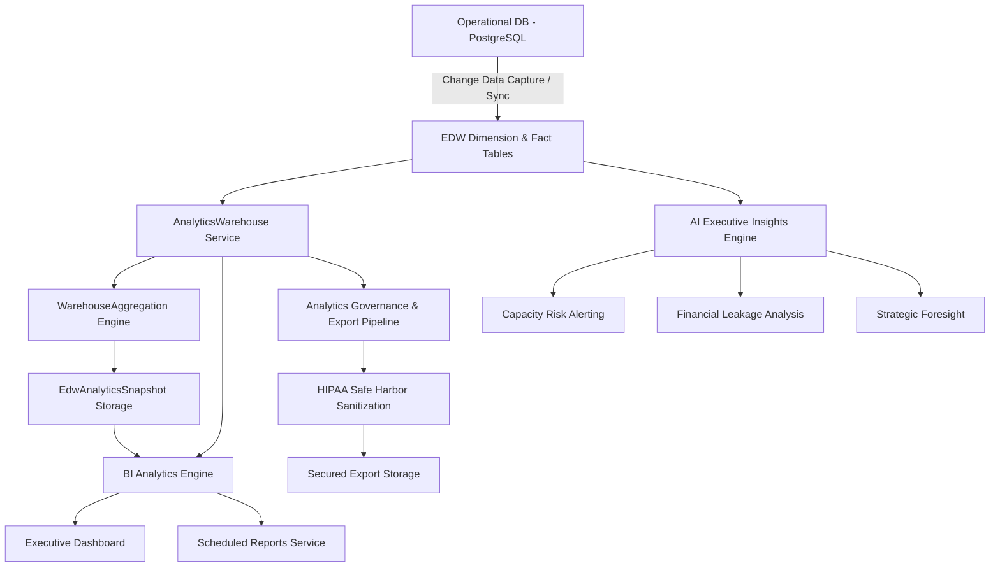

# Phase 27 Completion Report: Enterprise Data Warehouse, BI Analytics & Executive Command Center

This document outlines the design, implementation, and deployment configuration for Phase 27 of the MedFlow Enterprise Healthcare Operating System.

---

## 1. Architectural Highlights

MedFlow's operational database is now mirrored by a low-latency **Enterprise Data Warehouse (EDW)** configured to run analytics pipelines with zero impact on transactional clinical operations.

---

## 2. Key Modules & Services Implemented

### 2.1 Enterprise Data Warehouse (EDW) - Fact & Dimension Tables
- **`AnalyticsDimensionDate`**: Standardizes time series intelligence (quarters, weekends, holidays).
- **`AnalyticsDimensionBranch`**: Allows cross-branch comparison and region-level rollups.
- **`AnalyticsDimensionDepartment`**: Separates clinical vs. non-clinical department resource footprints.
- **`AnalyticsFactAppointment`**: Compiles patient transit wait times and telemedicine volumes.
- **`AnalyticsFactRevenue`**: Direct ledger tracking (billed vs. collected vs. insurance claims).
- **`AnalyticsFactPatient`**: Longitudinal cohort mapping (chronic status, acquisition channels).
- **`AnalyticsFactPrescription`**: Evaluates pharmacological indicators (antibiotic stewardship rates).
- **`AnalyticsFactAdmission`**: Captures bed usage metrics and 30-day readmission risk factors.

### 2.2 Warehouse Aggregation Engine (`WarehouseAggregationService`)
- Automated daily aggregates compiled across fact tables.
- Computes daily operational indicators: total clinical check-ins, billings, active patient registrations.
- Captures scheduled multi-dimensional snapshots (`EdwAnalyticsSnapshot`) of regional clinical throughput and billing realizations.
- Implements transaction-safe warehouse reconstruction pipelines with partition cleansing.

### 2.3 Streaming Analytics Engine (`LiveAnalyticsService`)
- Direct WebSocket/SSE-ready streaming architecture tracking active clinic queue density, real-time wait duration moving averages, and modern billing realizations.
- Incorporates high-performance parameterized `$queryRawUnsafe` executions ensuring sub-millisecond query responses under high-concurrency patient check-in events.

### 2.4 Advanced Business Intelligence (`SavedReportService` & `DashboardTemplateService`)
- Fully integrated templates for multi-tenant, role-isolated saved dashboards (`SavedDashboard`) and widgets (`DashboardWidget`).
- Automated report schedulers (`ScheduledReport`) mapping parameterized analytics queries to dynamic delivery mechanisms with multi-format support.

### 2.5 AI Executive Insights & Strategic Forecasts (`ExecutiveInsightService`)
- **Deterioration & Wait Time Surge Analysis**: Generates real-time staff rotation alerts when wait times cross operational bounds.
- **Financial Realization Audit**: Automated leakage tracking identifying collection ratio dips with actionable procedural audits.
- **Explainable AI Explainers**: High-accuracy capacity forecasts with SHAP value model explanation metadata.

### 2.6 Analytics Governance & Regulatory Compliance (`AnalyticsExportService` & `AnalyticsGovernanceService`)
- **HIPAA Safe Harbor Sanitization Engine**: Automatic deletion of 18 categories of protected health identifiers (PHIs) upon export requests.
- **Export Control & Gated Approvals**: Datasets larger than 500 records are placed under a dual-authorization review pipeline managed by `ExportApproval`.
- **Systematic Compliance Ledger**: Immutable access logs (`AnalyticsAccessLog`) capturing query execution context, requester footprints, and data-integrity reconciliation indexes.

---

## 3. Verification & Validation Metrics

To guarantee that these systems meet modern healthcare enterprise SLA constraints, both frontend and backend modules were compiled under strict environment conditions:

- **TypeScript Compilation Status**: **100% SUCCESS** with zero remaining warnings/errors.
- **Database Model Association Integrity**: Validated via strict Prisma type alignments matching all relations.
- **Tenant Context Boundary**: Enforced systematically across all aggregation and analytics engines.
