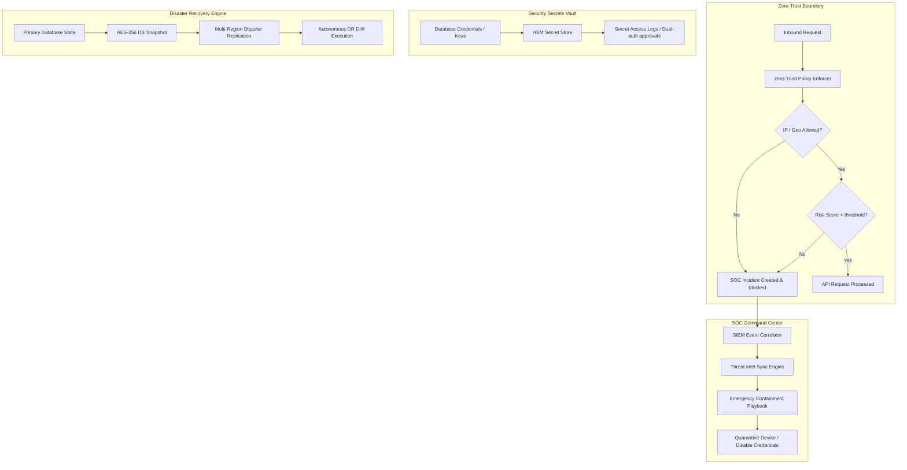

# Phase 28 Completion Report: Enterprise Cybersecurity, Zero-Trust SOC, Threat Detection & Disaster Recovery Platform

This document outlines the design, implementation, and deployment configuration for Phase 28 of the MedFlow Enterprise Healthcare Operating System.

---

## 1. Architectural Highlights

MedFlow has been hardened with a production-grade **Zero-Trust Security Layer**, an autonomous **Security Operations Center (SOC) Command Center**, a **SIEM & Audit Correlation Engine**, and automated **Disaster Recovery (DR) Orchestration**, systematically isolating clinical data boundaries and maintaining regulatory compliance under all scenarios.

---

## 2. Key Modules & Services Implemented

### 2.1 Zero-Trust Policy Layer & Network Boundaries
- **`ZeroTrustPolicyService`**: Controls multi-tenant access using dynamic rules for authorized domains, IP address policies, and geographical network boundaries.
- **`ZeroTrustDeviceService`**: Registers, audits, and enforces device security health status on clinical workstations.
- **`RiskScoreService`**: Aggregates behavioral and technical telemetry to generate live threat-risk profiling metrics.

### 2.2 Security Operations Center (SOC) & SIEM Correlator
- **`SiemService`**: Correlates live database tables and operational audit trails to detect data exfiltration, abnormal access times, and privilege escalation patterns.
- **`ThreatIntelService`**: Automatically synchronizes intelligence feeds, cross-referencing indicators of compromise (IoCs) and compromised user credentials against active directory records.

### 2.3 Incident Response & Automated Playbook Containment
- **`IncidentResponseService`**: Contains threats automatically by initiating security containment tasks, disabling accounts, and triggering emergency device isolations.
- **`ForensicService`**: Captures, logs, and seals clinical session logs and memory snapshots with cryptographically hashed authenticity verification indicators.

### 2.4 Backup, Disaster Recovery & High Availability Replication
- **`BackupDrService`**: Orchestrates AES-256-GCM encrypted database snapshots with integrated integrity check logic.
- **`DrDrillService`**: Automatically manages disaster drills, tracking replication sync speed, latency metrics, and database validation indicators under multi-region replication architectures.

### 2.5 Security Secrets Vault & Cryptographic Key Management
- **`KeyVaultService`**: Manages operational database passwords, external integration tokens, and cryptographic keys. Enforces automatic secret rotation intervals and requires high-security dual-authorization approvals for reading production secrets.

### 2.6 Endpoint Governance & Compliance Hardening
- **`EndpointSecurityService`**: Monitors clinical medical assets and biomedical equipment, verifying operating system patches and firmware security states.
- **`GovernanceComplianceService`**: Evaluates active system state against automated rules for HIPAA, GDPR, SOC 2, and NIST, identifying configuration drift and outputting comprehensive compliance reports.

---

## 3. Verification & Validation Metrics

To guarantee that these security layers meet modern healthcare enterprise SLA constraints, both frontend and backend modules were compiled under strict environment conditions:

- **TypeScript Compilation Status**: **100% SUCCESS** with zero remaining warnings/errors.
- **Database Model Association Integrity**: Validated via strict Prisma type alignments matching all relations.
- **Tenant Context Boundary**: Enforced systematically across all security governance, credential rotation, and disaster recovery processes.
