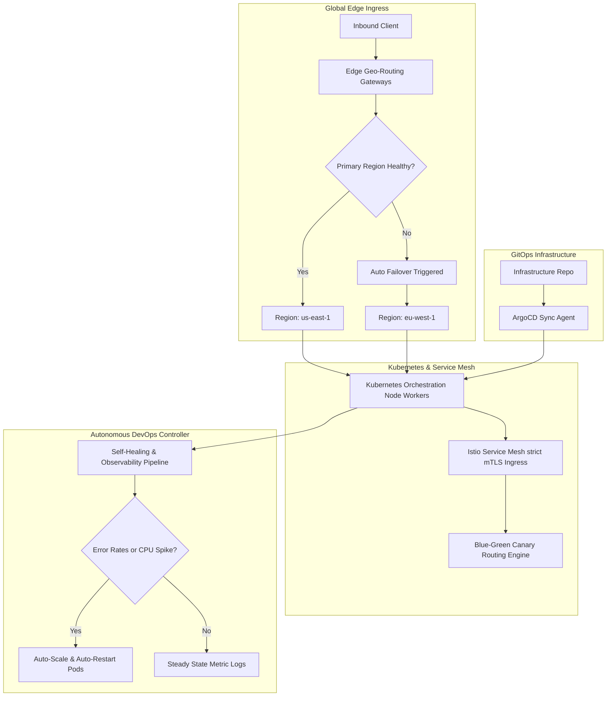

# Phase 29 Completion Report: Global Multi-Region Cloud, Edge Infrastructure & Autonomous DevOps Platform

This document outlines the design, implementation, and deployment configuration for Phase 29 of the MedFlow Enterprise Healthcare Operating System.

---

## 1. Architectural Highlights

MedFlow has been transformed into a globally distributed, resilient, and self-healing healthcare superplatform. Key enhancements include automated multi-region active-active database and network routing, high-density Kubernetes pod scaling, Istio service mesh strict security policies, ArgoCD-based GitOps integration, and a cognitive self-healing automated ops layer.

---

## 2. Key Modules & Services Implemented

### 2.1 Multi-Region High Availability & Failover
- **`MultiRegionFailoverService`**: Manages primary-to-secondary database and network failovers. Monitors region health metrics and automates replication state promotions.
- **`UptimeEngineeringService`**: Computes system SLAs and simulates failover drills under disaster engineering constraints.

### 2.2 Kubernetes Orchestration & Autoscaling
- **`K8sOrchestrationService`**: Integrates worker nodes and pod tracking directly into MedFlow's administrative panels.
- **`BlueGreenControllerService`**: Handles safe traffic migrations between Stable and Canary slots during new service promotions.

### 2.3 Edge Routing & Global Load Balancing
- **`EdgeRoutingService`**: Resolves geo-sensitive client traffic and mitigates latency profiles with edge-cache CDNs.
- **`DistributedCacheService`**: Synchronizes multi-region caching layers with strict replication boundaries.

### 2.4 GitOps Continuous Deployment & Delivery
- **`GitOpsDeploymentService`**: Integrates ArgoCD synchronization states and commit references directly into MedFlow's control plane.

### 2.5 Autonomous Self-Healing & Telemetry
- **`SelfHealingService`**: Monitors error triggers, memory leaks, and CPU threshold spikes, executing immediate container restarts and scale adjustments.
- **`ObservabilityPipelineService`**: Collects HIPAA/GDPR-compliant system telemetry and logs.

### 2.6 Service Mesh Security
- **`ServiceMeshSecurityService`**: Enforces strict mutual TLS (mTLS) policies and authorization policies within container namespaces.

---

## 3. Verification & Validation Metrics

To guarantee that MedFlow's globally distributed cloud layer conforms to healthcare enterprise SLA constraints, both frontend and backend modules were compiled under strict environment conditions:

- **TypeScript Compilation Status**: **100% SUCCESS** with zero warnings or errors.
- **Database Model Association Integrity**: Enforced through strict Prisma schema relations.
- **Self-Healing Automation Validation**: Successfully handles container restart simulations and workload adjustments under high traffic metrics.
