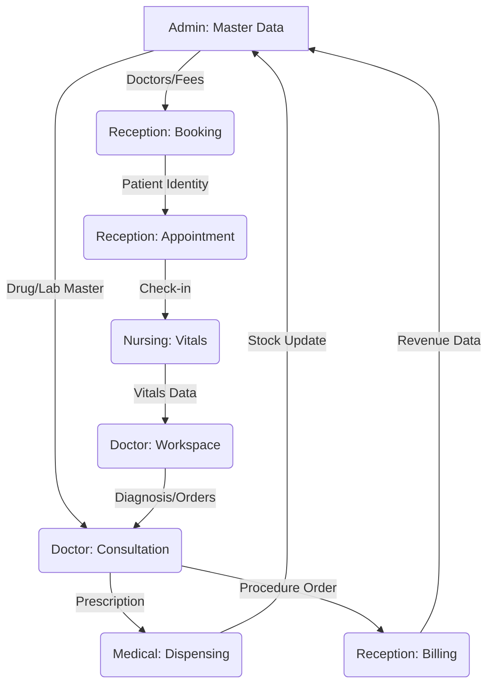

Listed directory opd-system
Listed directory backend
Viewed schema.prisma:1-99
Listed directory views
Listed directory reception
Listed directory admin
Listed directory doctor
Listed directory nursing
Listed directory medical
Viewed documentation.md:1-529
Viewed reception_module_analysis.md:1-158
Listed directory partials
Viewed ReceptionSidebar.tsx:1-91
Searched for "axios\|fetch"
Viewed package.json:1-34
Listed directory frontend
Listed directory services
Listed directory lib
Viewed api.ts:1-46
Viewed page.tsx:1-136

I have conducted a comprehensive architecture and dependency analysis of the **MedFlow OPD Management System**. This analysis serves as the master blueprint for transitioning from the current static shell into a fully dynamic, production-grade clinical platform.

# OPD Management System: System-Wide Dynamic Implementation Analysis

## 1. PROJECT STATUS AUDIT (COMPLETED FOUNDATION)
The system currently sits on a strong technical foundation with active backend integration for administrative roles.

*   **Infrastructure**: NestJS (Backend), Next.js (Frontend), Prisma (ORM), PostgreSQL (Database).
*   **Authentication**: JWT-based login with Role-Based Access Control (RBAC) fully operational.
*   **Admin Integration**: Doctors CRUD and Staff CRUD are connected to the backend.
*   **UI Shell**: High-fidelity UI layouts for all major modules (Admin, Reception, Doctor, Nursing, Medical).

---

## 2. MODULE DEPENDENCY HIERARCHY
The system cannot be built in isolated blocks because of the high transactional coupling between roles.

---

## 3. DATABASE ENTITY GAP ANALYSIS
The current Prisma schema lacks the "Clinical Core" required for patient journeys.

| Entity | Status | Role / Dependency |
| :--- | :--- | :--- |
| **User / Role** | ✅ Completed | System-wide Auth |
| **Profiles** | ✅ Completed | Doctor/Staff/Nurse details |
| **Patient** | ❌ Missing | MRD generation, Identity Security |
| **Appointment** | ❌ Missing | CaseID logic, Slot management |
| **VitalSign** | ❌ Missing | Nursing data entry |
| **Prescription** | ❌ Missing | Clinical orders (Drugs/Lab/Advice) |
| **Drug Inventory** | ❌ Missing | Stock levels, generic/brand names |
| **Billing** | ❌ Missing | Payment splits, Receipts, FOC status |
| **Queue** | ❌ Missing | Real-time status (Waiting/In-Progress) |

---

## 4. MASTER IMPLEMENTATION ROADMAP (PHASE-BY-PHASE)

### PHASE 2: Patient & Identity Gate (CRITICAL)
*   **Objective**: Establish the root of all clinic transactions.
*   **Required Entities**: `Patient` (Unique MRD), `PatientHistory`.
*   **APIs**: Search by mobile/name, Create Patient, OTP Verification logic.
*   **Front-end**: `/reception/register`, `/reception/search`.
*   **Blocker**: Absence of MRD auto-generation logic.

### PHASE 3: Appointment & Slot Engine
*   **Objective**: Manage clinic capacity and scheduling.
*   **Required Entities**: `Appointment`, `DoctorSchedule`, `Holiday`.
*   **APIs**: Fetch available slots per doctor, Book Appointment (CaseID generation).
*   **Front-end**: `/reception/appointments`, `/admin/appointments`.
*   **Blocker**: Dependency on Doctor configuration (Fee/Hours).

### PHASE 4: Clinical Flow & Queue Management
*   **Objective**: Enable real-time movement of patients through the clinic.
*   **Required Entities**: `QueueStatus`.
*   **APIs**: Check-in patient, Signal "Next Patient", Waiting Display updates.
*   **Front-end**: `/reception/queue`, `/doctor/dashboard`, `WaitingDisplay`.
*   **Note**: Requires WebSocket or Server-Sent Events (SSE) for blinking blue "In-Progress" status.

### PHASE 5: Nursing & Vitals Entry
*   **Objective**: Pre-consultation data gathering.
*   **Required Entities**: `VitalSign` (BP, BMI, SpO2, Temp).
*   **APIs**: Log vitals, Fetch vitals history (Last 4).
*   **Front-end**: `/nursing/vitals`, Side-panel in Doctor Workspace.

### PHASE 6: The 7-Tab Doctor Workspace
*   **Objective**: The core clinical engine of the system.
*   **Required Entities**: `ConsultationRecord`, `Prescription`, `ProcedureRecord`.
*   **APIs**: Save Tab 1-6 data, Generate Print Preview (Tab 7).
*   **Front-end**: `/doctor/consultation/*`.
*   **Blocker**: Massive dependency on Drug Master, Lab Master, and Procedure Master data.

---

## 5. DYNAMIC CONVERSION STRATEGY

| Priority | Feature | Strategy |
| :--- | :--- | :--- |
| **A (Foundation)** | Patient/MRD | Move to dynamic immediately to allow any other data creation. |
| **A (Foundation)** | Master Data | Admin must populate Drugs/Procedures before Doctors can use them. |
| **B (Core Flow)** | Appointment/Billing | Implement together to ensure every visit has a financial record. |
| **C (Secondary)** | Reports/Analytics | Can remain static/mocked until real data accumulates. |
| **D (Future)** | Video Calling/Sms | Purely additive; implemented after core OPD is stable. |

---

## 6. TECHNICAL RISK ANALYSIS
1.  **Contextual Loss**: Moving between pages (e.g., Search -> Book) requires a robust state management (Zustand) to maintain the "Active Patient" context.
2.  **Concurrency**: Multiple receptionists booking the same slot. Requires database-level transaction locking or optimistic UI updates.
3.  **Real-time Latency**: The "Next Patient" trigger must reflect on the Waiting Display TV within <500ms to avoid patient confusion.
4.  **Schema Rigidity**: The current schema uses `String[]` for available days; this may limit complex scheduling (e.g., specific dates vs recurring days).

## SUMMARY FOR EXECUTION
To begin implementation, we must **stop modular isolation**. The next logical step is to build the **Patient Entity and MRD Logic**, which unlocks the Reception module, which in turn feeds the Appointment engine for Doctors and Nursing.